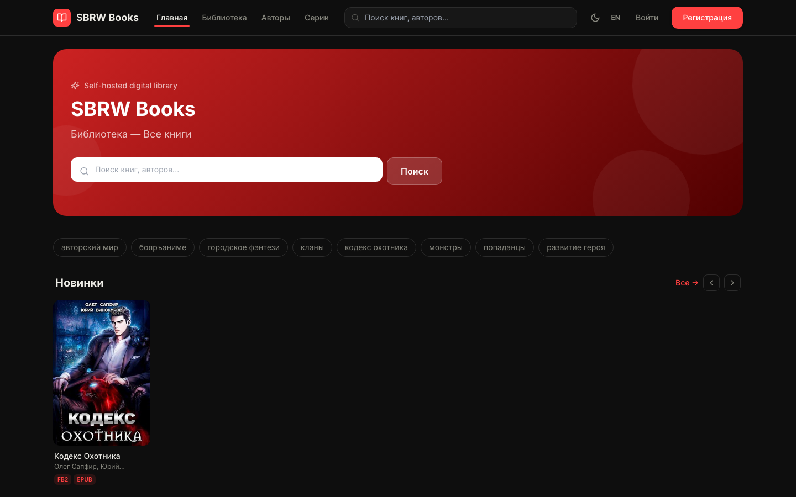
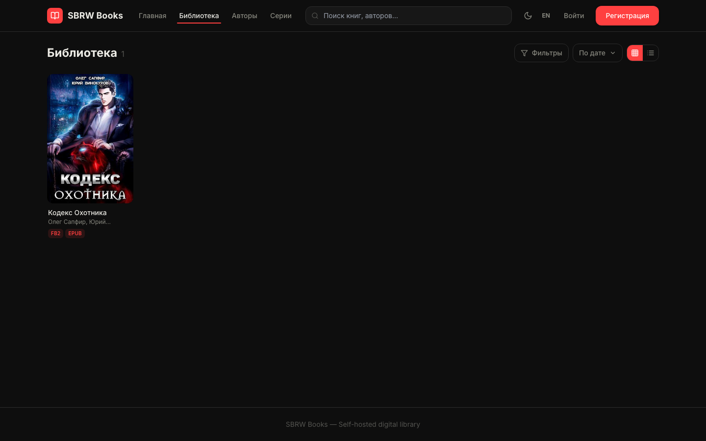
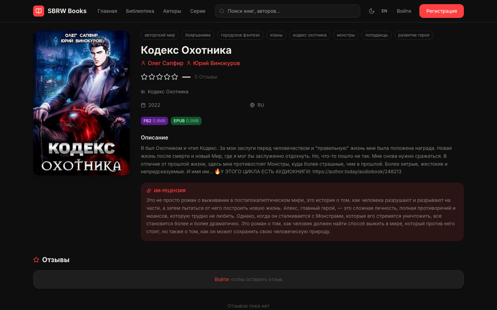
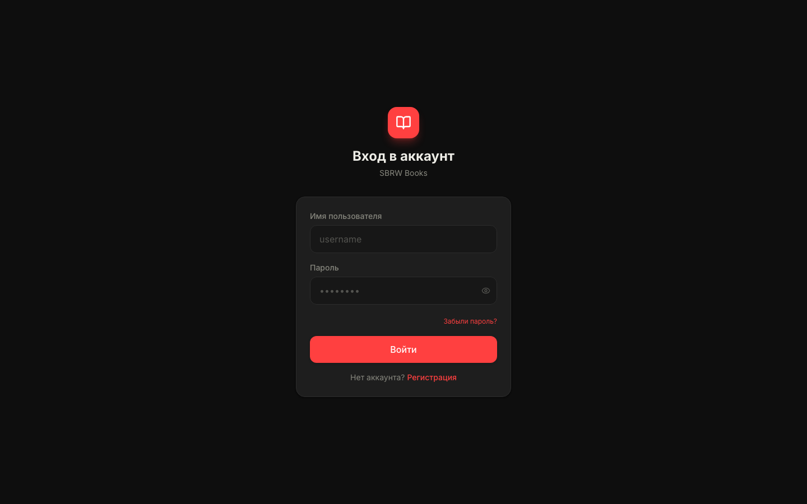
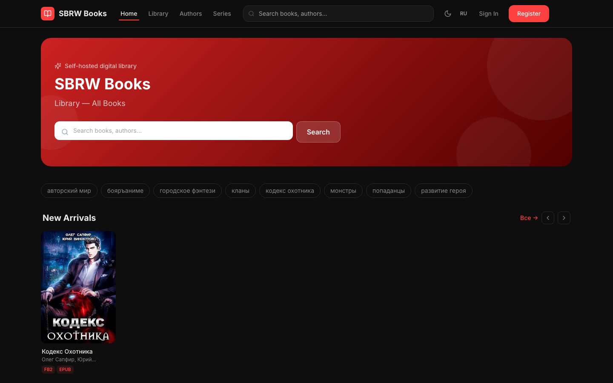
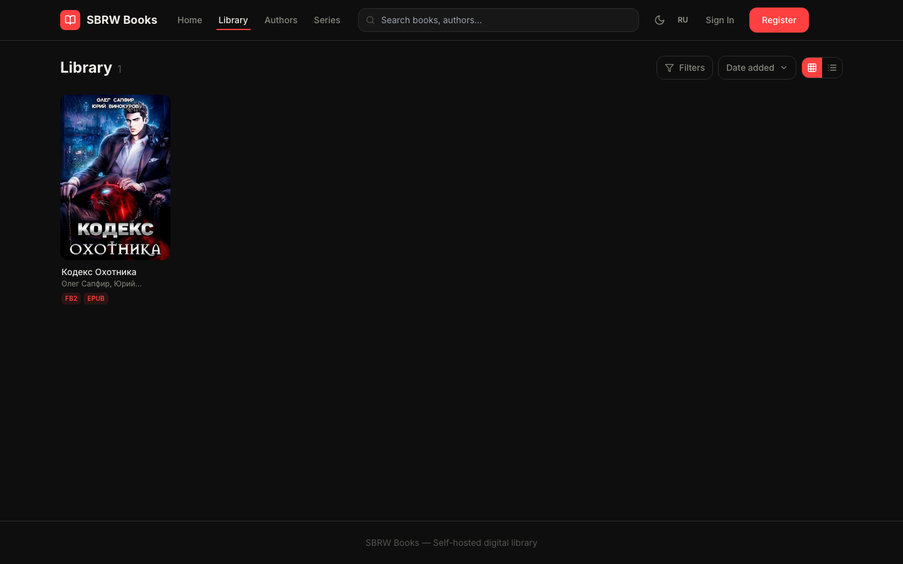
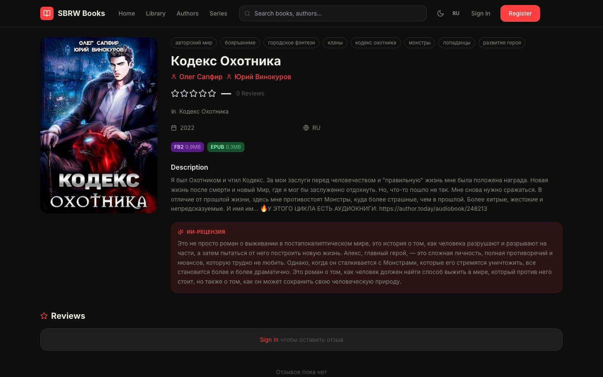

# SBRW-Book

> **[🇷🇺 Русский](#русский)** | **[🇬🇧 English](#english)**

---

## Русский

**Самохостируемая цифровая библиотека** с ИИ-рецензиями, онлайн-читалкой, OPDS-каталогом и интеграцией с Telegram. Развёртывается одной командой.

### Скриншоты

<p align="center">
  
  
</p>
<p align="center">
  
  
</p>

### Возможности

| Категория | Функции |
|-----------|---------|
| **Библиотека** | EPUB, PDF, FB2, TXT — загрузка, конвертация, обложки, серии, авторы, теги |
| **Читалка** | Онлайн EPUB/PDF-читалка, синхронизация прогресса, аннотации и закладки |
| **Метаданные** | Google Books, Open Library, ЛитРес, Author.Today, Fantlab |
| **ИИ** | Автоматические рецензии и предложения метаданных: Ollama, Claude, OpenAI, Gemini, DeepSeek |
| **Пользователи** | JWT, 2FA (TOTP + Telegram), сессии, шифрование персональных данных |
| **Социальное** | Оценки, рецензии, комментарии, обсуждения, личные полки |
| **Telegram** | Бот-уведомитель (2FA, новые логины, подписки) + бот загрузки книг для администраторов |
| **OPDS** | Каталог для KOReader, Moonreader и других e-reader приложений |
| **Чат** | Встроенный мессенджер на WebSocket |
| **Администрирование** | Дашборд: аналитика, пользователи, рассылки, Docker-менеджер, VPN, LLM |

### Быстрый старт

```bash
git clone https://github.com/sbrw-evc/SBRW-book.git sbrw-book && cd sbrw-book
cp .env.example .env          # задайте SECRET_KEY и POSTGRES_PASSWORD
docker compose up -d
# http://localhost      — библиотека
# http://localhost:8080 — администрирование
```

При первом запуске откройте `http://localhost/setup` — мастер настройки создаст администратора.

### Стек

| Слой | Технология |
|------|-----------|
| Backend | Django 5.1 + DRF + Django Channels |
| Frontend | React 18 + Vite + Zustand + TanStack Query |
| Admin | React 18 + Vite + Recharts |
| LLM-прокси | FastAPI + httpx |
| БД | PostgreSQL 16, MongoDB 7, Redis 7 |
| Очередь | Apache Kafka |
| ИИ (локально) | Ollama |
| Прокси | Nginx |

### Документация

- [Wiki (GitHub)](../../wiki) — полная документация, архитектура, бизнес-процессы
- [docs/wiki/](docs/wiki/) — исходники wiki в репозитории
- [CHANGELOG.md](CHANGELOG.md) — история изменений

### Лицензия

MIT © 2026 Дмитрий Ляхов — подробности в [LICENSE](LICENSE).

---

## English

**Self-hosted digital library** with AI-generated reviews, an online reader, an OPDS catalog, and Telegram integration. Deploy with a single command.

### Screenshots

<p align="center">
  
  
</p>
<p align="center">
  
  
</p>

### Features

| Category | Capabilities |
|----------|-------------|
| **Library** | EPUB, PDF, FB2, TXT — upload, conversion, covers, series, authors, tags |
| **Reader** | Online EPUB/PDF reader, reading progress sync, annotations and bookmarks |
| **Metadata** | Google Books, Open Library, LitRes, Author.Today, Fantlab |
| **AI** | Auto-generated reviews and metadata suggestions: Ollama, Claude, OpenAI, Gemini, DeepSeek |
| **Users** | JWT auth, 2FA (TOTP + Telegram), session management, field-level encryption |
| **Social** | Ratings, reviews, comments, discussions, personal shelves |
| **Telegram** | Notification bot (2FA, new logins, subscriptions) + admin book upload bot |
| **OPDS** | Catalog for KOReader, Moonreader, and other e-reader apps |
| **Chat** | Built-in WebSocket messenger with history and attachments |
| **Administration** | Dashboard: analytics, users, newsletters, Docker manager, VPN, LLM config |

### Quick Start

```bash
git clone https://github.com/sbrw-evc/SBRW-book.git sbrw-book && cd sbrw-book
cp .env.example .env          # set SECRET_KEY and POSTGRES_PASSWORD
docker compose up -d
# http://localhost      — library
# http://localhost:8080 — administration
```

On first run, open `http://localhost/setup` — the setup wizard will create your admin account.

### Tech Stack

| Layer | Technology |
|-------|-----------|
| Backend | Django 5.1 + DRF + Django Channels |
| Frontend | React 18 + Vite + Zustand + TanStack Query |
| Admin | React 18 + Vite + Recharts |
| LLM proxy | FastAPI + httpx |
| Databases | PostgreSQL 16, MongoDB 7, Redis 7 |
| Message queue | Apache Kafka |
| Local AI | Ollama |
| Proxy | Nginx |

### Documentation

- [Wiki (GitHub)](../../wiki) — full documentation, architecture, business processes
- [docs/wiki/](docs/wiki/) — wiki sources in repository
- [CHANGELOG.md](CHANGELOG.md) — release history

### License

MIT © 2026 Dmitry Lyakhov — see [LICENSE](LICENSE).
