# Архитектура / Architecture

> **[🇷🇺 Русский](#русский)** | **[🇬🇧 English](#english)**

---

## Русский

### Обзор системы

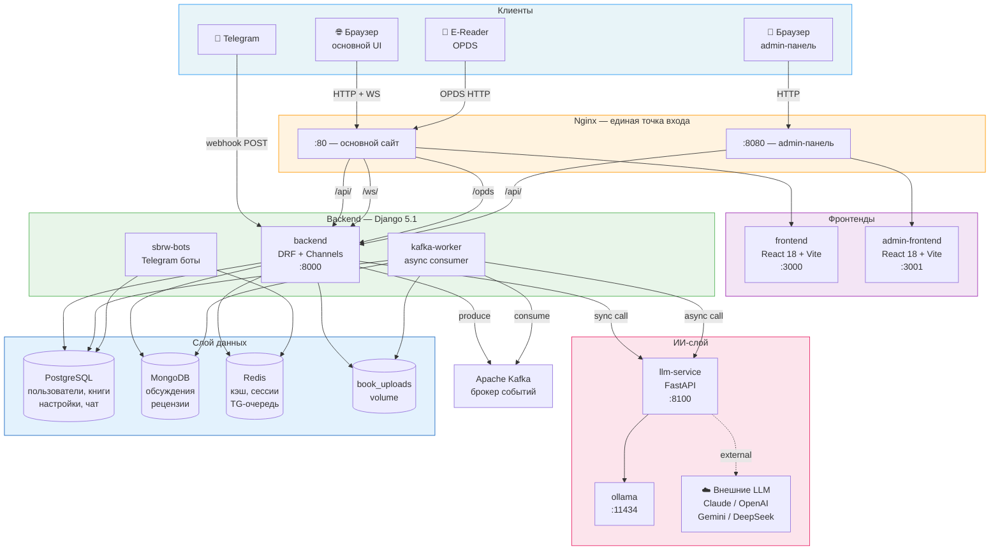

### Архитектура Django-приложений

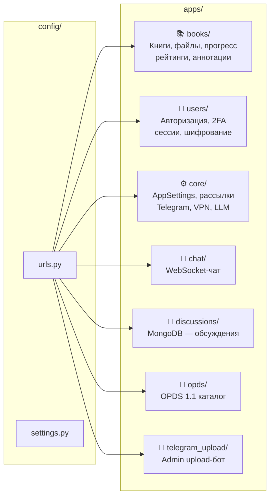

### Схема базы данных (PostgreSQL)

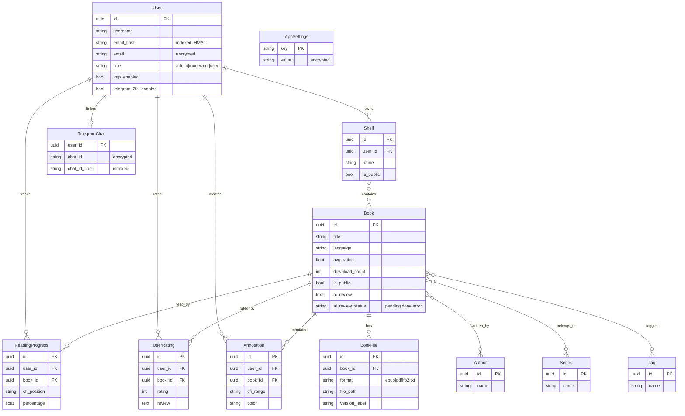

### Поток событий через Kafka

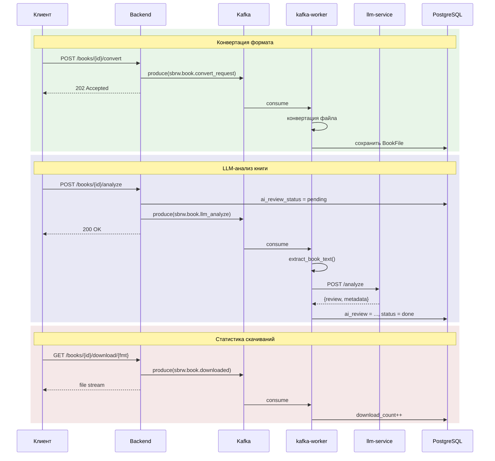

### Стриминг ИИ-размышлений (SSE)

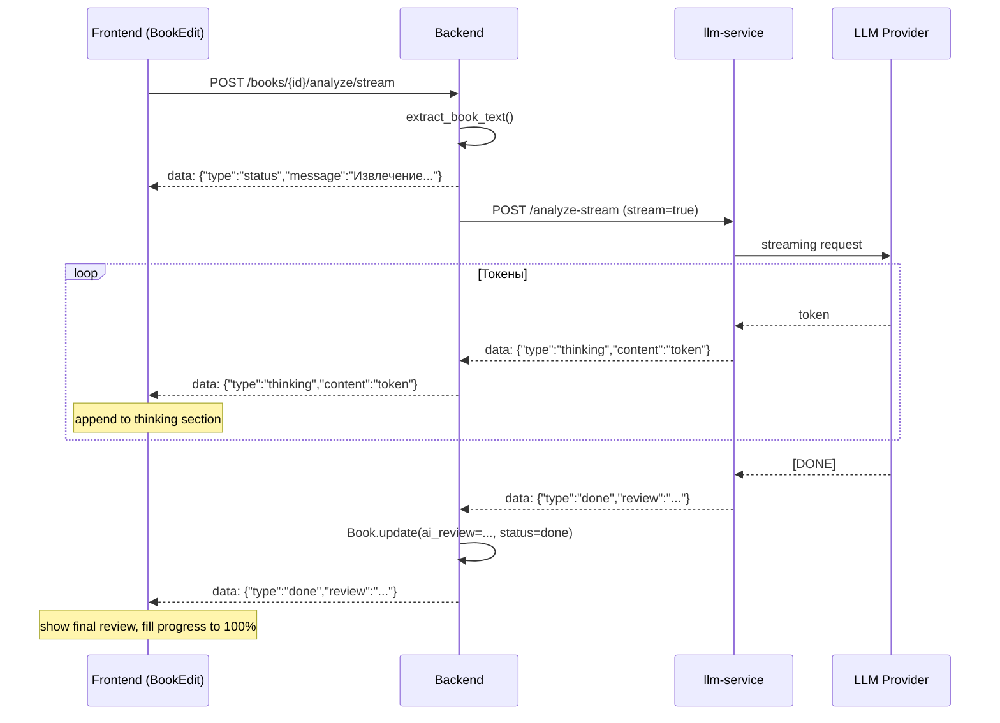

**Таймаут:** 300 секунд на всех уровнях (frontend AbortController → backend requests timeout → LLM service httpx.Timeout). Пользователь может нажать «Остановить» в любой момент.

---

### WebSocket-чат (Django Channels)

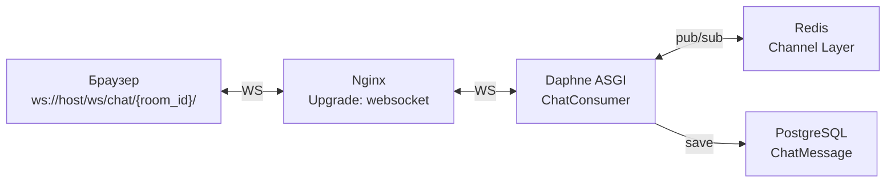

---

## English

### System Overview

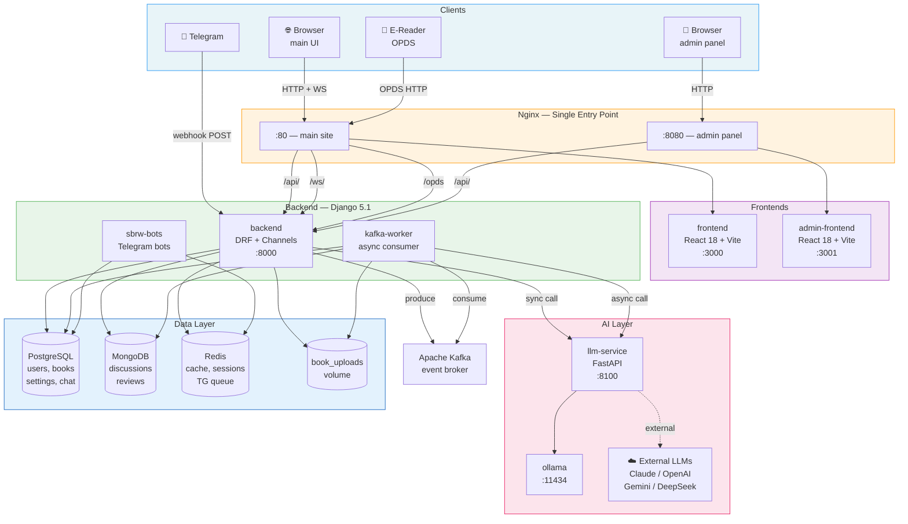

### Django Application Architecture

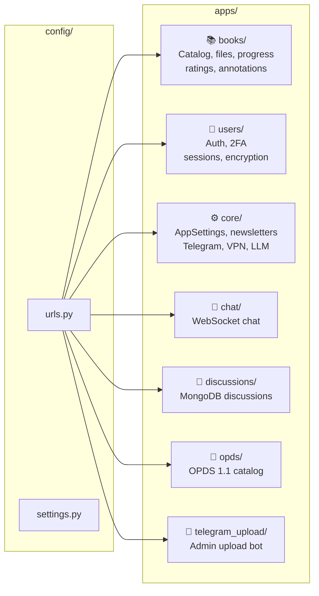

### Database Schema (PostgreSQL)

### Kafka Event Flow

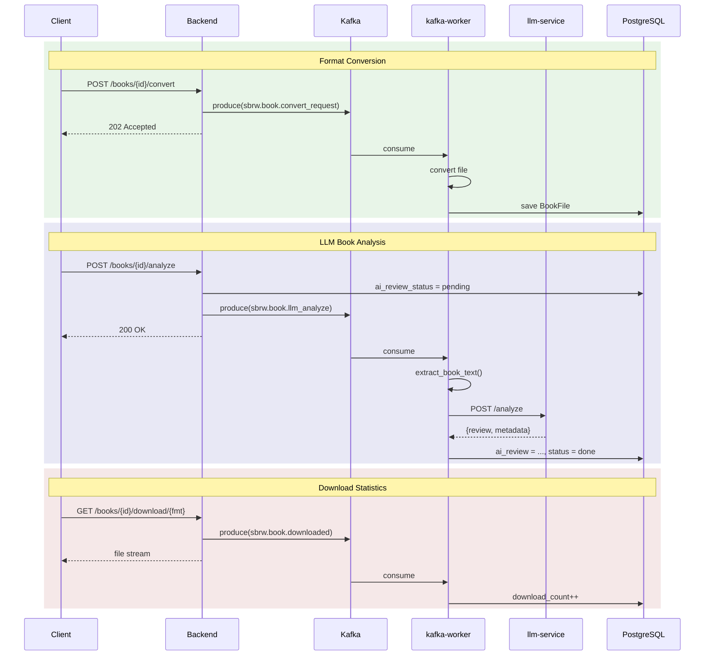

### AI Thinking Stream (SSE)

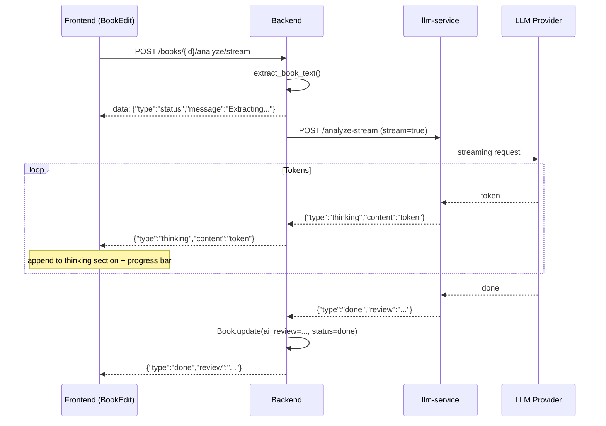

**Timeout:** 300 s at all levels. User can click "Stop" at any time (AbortController).

---

### WebSocket Chat (Django Channels)

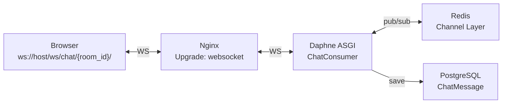
