# Бизнес-процессы / Business Processes
> ← [Главная / Home](home)


> **[🇷🇺 Русский](#русский)** | **[🇬🇧 English](#english)**

---

## Русский

### 1. Регистрация и аутентификация

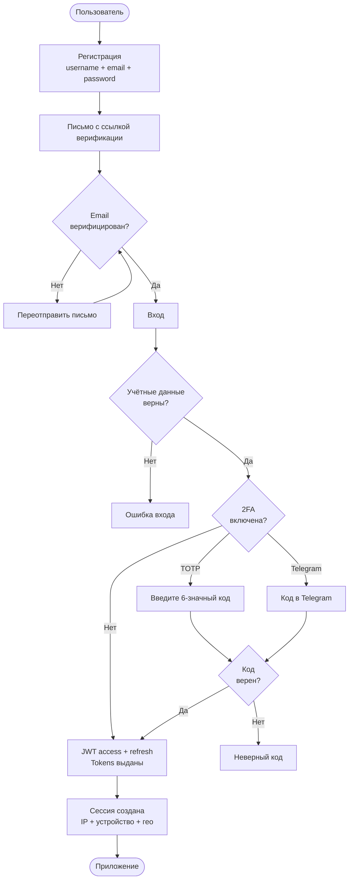

### 2. Загрузка книги

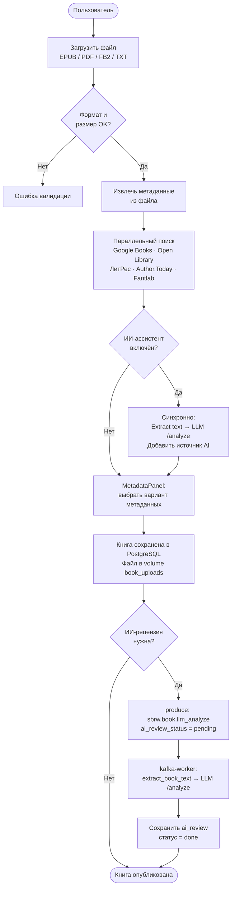

### 3. Загрузка аудиокниги

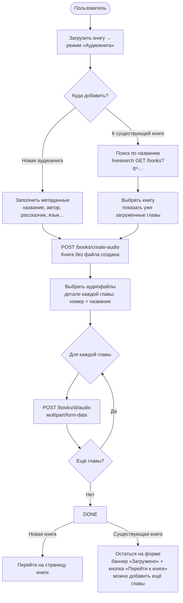

### 4. Прослушивание аудиокниги

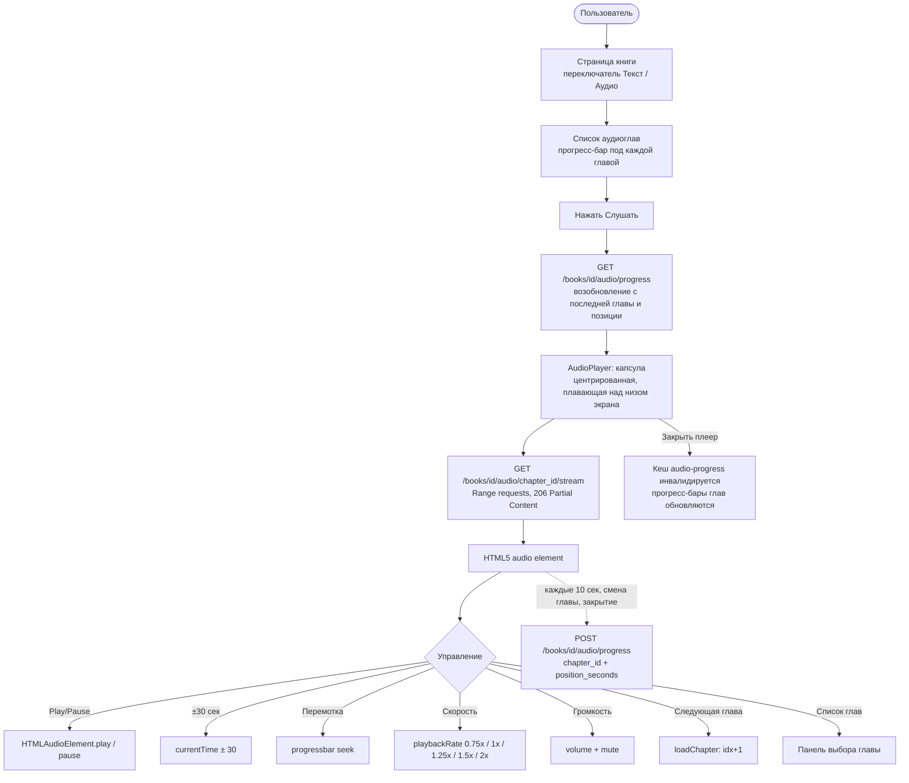

### 5. Чтение книги

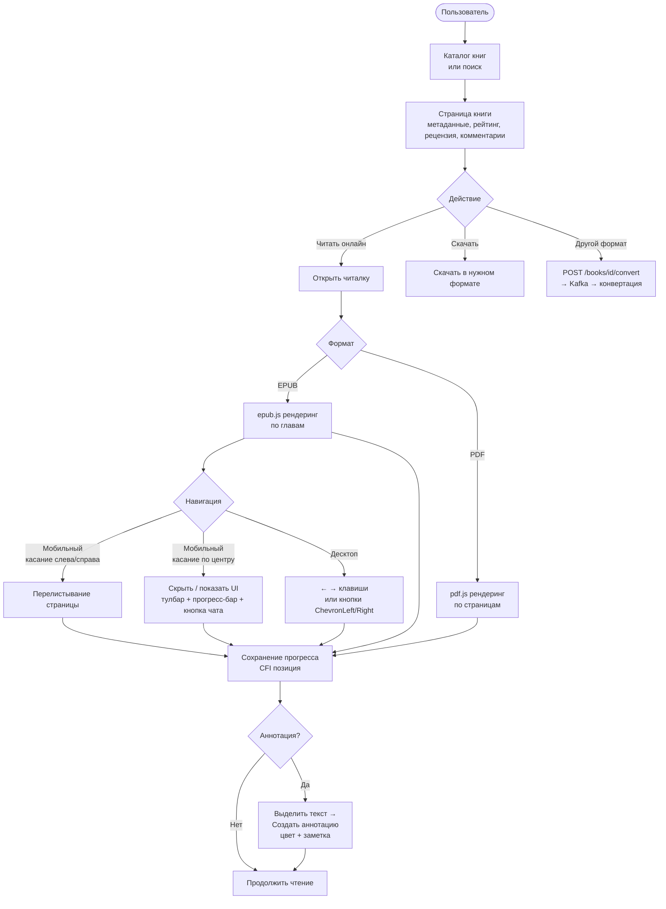

### 4. ИИ-анализ книги

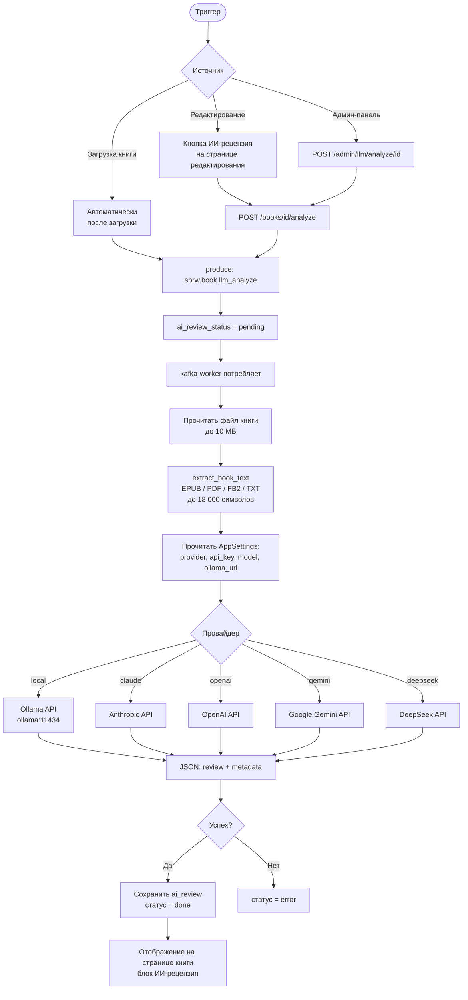

### 5. Telegram-бот загрузки (администратор)

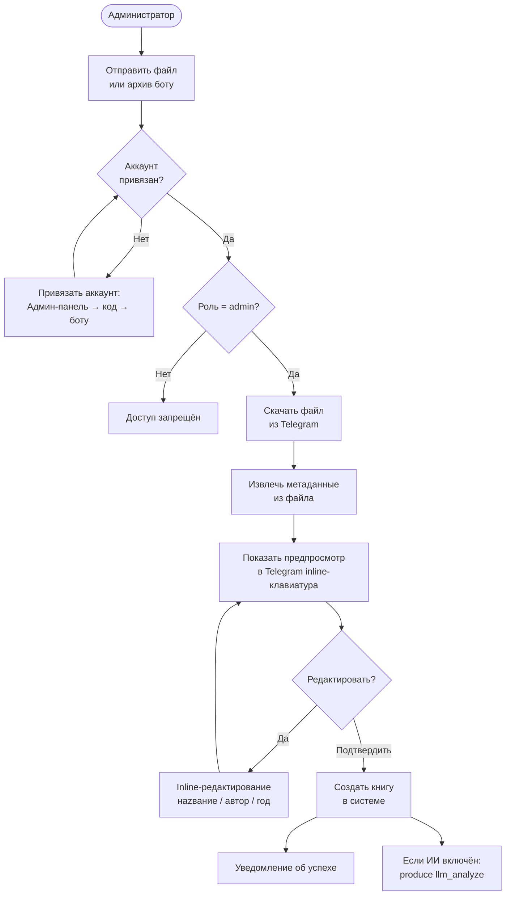

### 6. Настройка ИИ-провайдера в админ-панели

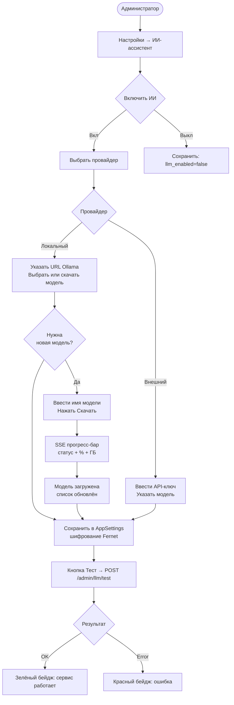

---

## English

### 1. Registration and Authentication

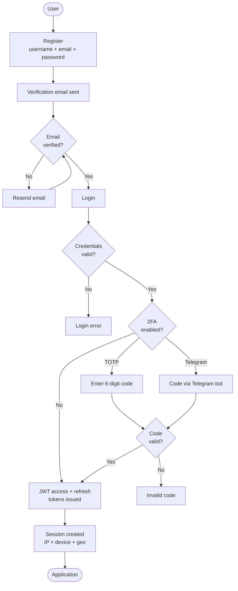

### 2. Book Upload

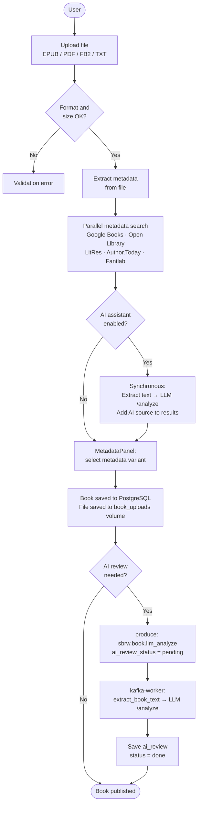

### 3. Uploading an Audiobook

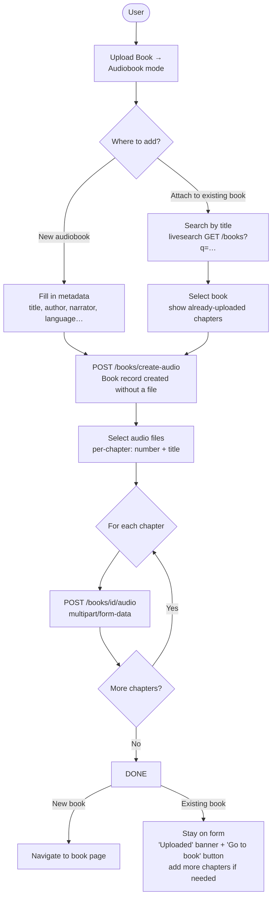

### 4. Listening to an Audiobook

```mermaid
flowchart TD
    A([User]) --> DETAIL[Book page\nText / Audio toggle]
    DETAIL --> CHAPTERS[Audio chapter list\nprogress bar under each chapter]
    CHAPTERS --> PLAY[Click Listen]
    PLAY --> RESUME[GET /books/id/audio/progress\nresumes last chapter and position]
    RESUME --> PLAYER[AudioPlayer: capsule\ncentered, floating above the bottom edge]

    PLAYER --> STREAM[GET /books/id/audio/chapter_id/stream\nRange requests → 206 Partial Content]
    STREAM --> HTML5[HTML5 audio element]

    HTML5 --> CONTROLS{Controls}
    CONTROLS -->|Play/Pause| PLAYPAUSE[HTMLAudioElement.play / pause]
    CONTROLS -->|±30 sec| SKIP[currentTime ± 30]
    CONTROLS -->|Seek| SEEK[progress bar seek]
    CONTROLS -->|Speed| RATE[playbackRate 0.75 / 1 / 1.25 / 1.5 / 2×]
    CONTROLS -->|Volume| VOL[volume + mute]
    CONTROLS -->|Next chapter| NEXT_CH[loadChapter(idx + 1)]
    CONTROLS -->|Chapter list| LIST[Chapter selector panel]

    HTML5 -.every 10 sec / chapter change / close.-> SAVE[POST /books/id/audio/progress\nchapter_id + position_seconds]
    PLAYER -->|Close player| CLOSE[audio-progress cache invalidated\nchapter progress bars refresh]
```

### 5. Reading a Book

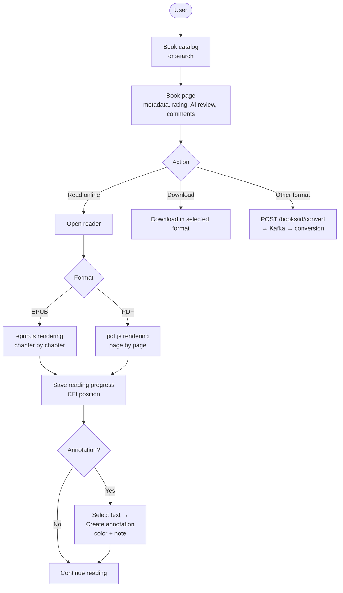

### 4. AI Book Analysis

```mermaid
flowchart TD
    TRIGGER([Trigger]) --> SRC{Source}
    SRC -->|Book upload| AUTO[Automatically\nafter upload]
    SRC -->|Book edit page| BTN[AI Review button]
    SRC -->|Admin panel| ADMIN[POST /admin/llm/analyze/id]

    AUTO --> KAFKA_P[produce: sbrw.book.llm_analyze]
    BTN --> API[POST /books/id/analyze]
    ADMIN --> API
    API --> KAFKA_P

    KAFKA_P --> STATUS[ai_review_status = pending]
    STATUS --> KW[kafka-worker consumes]
    KW --> READ[Read book file\nup to 10 MB]
    READ --> EXTRACT[extract_book_text()\nEPUB / PDF / FB2 / TXT\nup to 18 000 chars]
    EXTRACT --> SETTINGS[Read AppSettings:\nprovider, api_key, model, ollama_url]
    SETTINGS --> PROV{Provider}
    PROV -->|local| OLLAMA[Ollama API\nhttp://ollama:11434]
    PROV -->|claude| CLAUDE[Anthropic API]
    PROV -->|openai| OPENAI[OpenAI API]
    PROV -->|gemini| GEMINI[Google Gemini API]
    PROV -->|deepseek| DS[DeepSeek API]

    OLLAMA --> LLM_RESP[JSON: review + metadata]
    CLAUDE --> LLM_RESP
    OPENAI --> LLM_RESP
    GEMINI --> LLM_RESP
    DS --> LLM_RESP

    LLM_RESP --> OK{Success?}
    OK -->|Yes| SAVE_REVIEW[Save ai_review\nstatus = done]
    OK -->|No| ERR_STATUS[status = error]

    SAVE_REVIEW --> DISPLAY[Displayed on book page\nin the AI Review block]
```

### 5. Telegram Admin Upload Bot

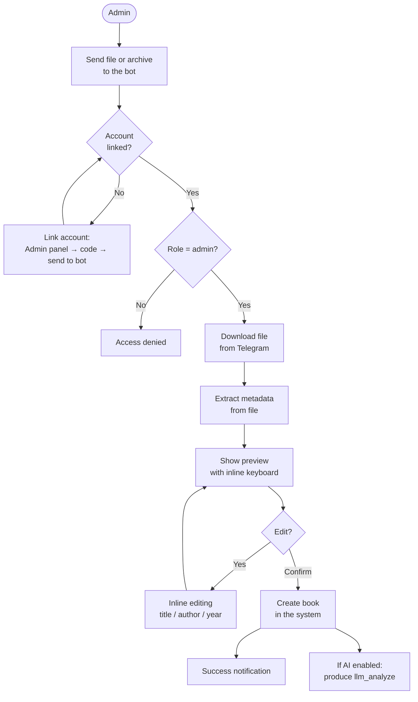

### 6. AI Provider Configuration in Admin Panel

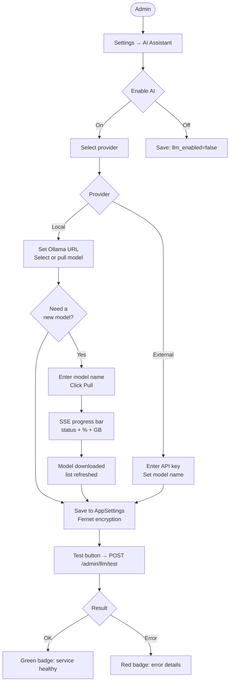
